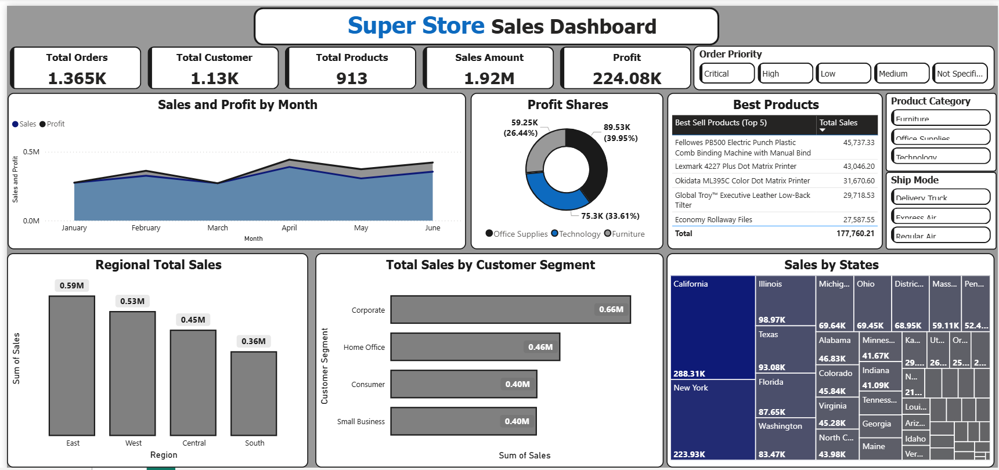
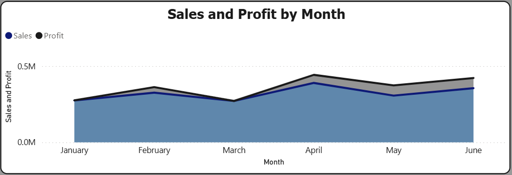
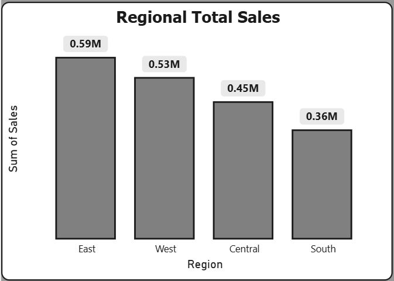

# SuperStore_Sales_Analysis
## Project Overview
This project analyzes retail sales data from January to June using Power BI.
The objective is to identify key sales drivers, profitable product categories, customer segments, and regional performance trends.
The findings are intended to support management decision-making and business growth strategies.

## Business Problem
Management needs to visibility into:L
- Sales performance trends
- Profitability by product category
- Customer segment contribution
- Regional sales performance
Without this information, it is difficult to make informed decisions regarding sales strategy and resource allocation.

## Dataset
Source: Sample Superstore Dataset
Records: 1,900
Period Covered: January - June
Key Fields:
- Order Date
- Sales
- Profit
- Product Category
- Customer Segment
- State
- Region

## Tool Used
- Power BI
- Power Query
- DAX
- Miscrosoft PowerPoint
- Miscrosoft Excel

## Analysis Process
1. Imported and reviewed raw sales data
2. Performed data cleaning and validation
3. Created KPI measure using DAX
4. Developed interactive Power BI dashboard
5. Analyzed sales, profit, customer, and regional performance
6. Generated business recommendations

## Dashboard Preview

### Overview Dashboard

### Sales Trend Analysis

### Regional Performance

## Key Findings

### Overall Performance
- Total Sales: $1.92M
- Total Profit: $224K
- Total Orders: 1.36K

### Product Categories
- Office Supplies generated the highest profit.
- Furniture generated the lowest profit.

### Customer Segment
- Corporate customers generated the highest sales.

### Regional Analysis
- East and West regions outperformed Central and South regions.

## Business Recommendations
1. Increase investment in Office Supplies products.
2. Expand marketing efforts toward Corporate customers.
3. Investigate causes of low Furniture profitability.
4. Analyze drivers behind April's sales peak.
5. Develop growth strategies for underperforming regions.

## Repository Structure
├── data
├── dashboard
├── report
├── images
└── README.md
